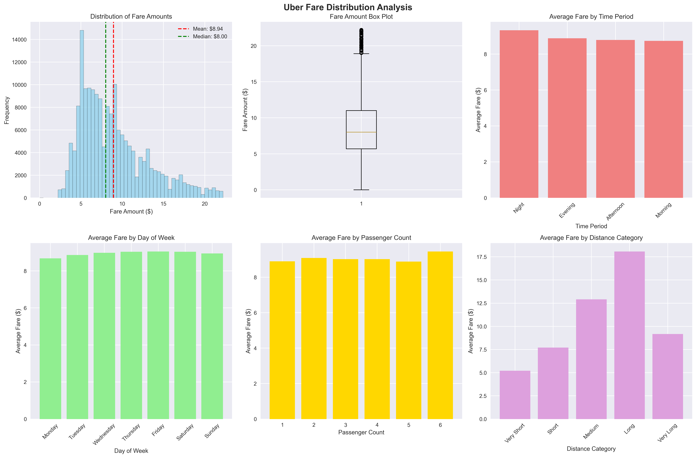
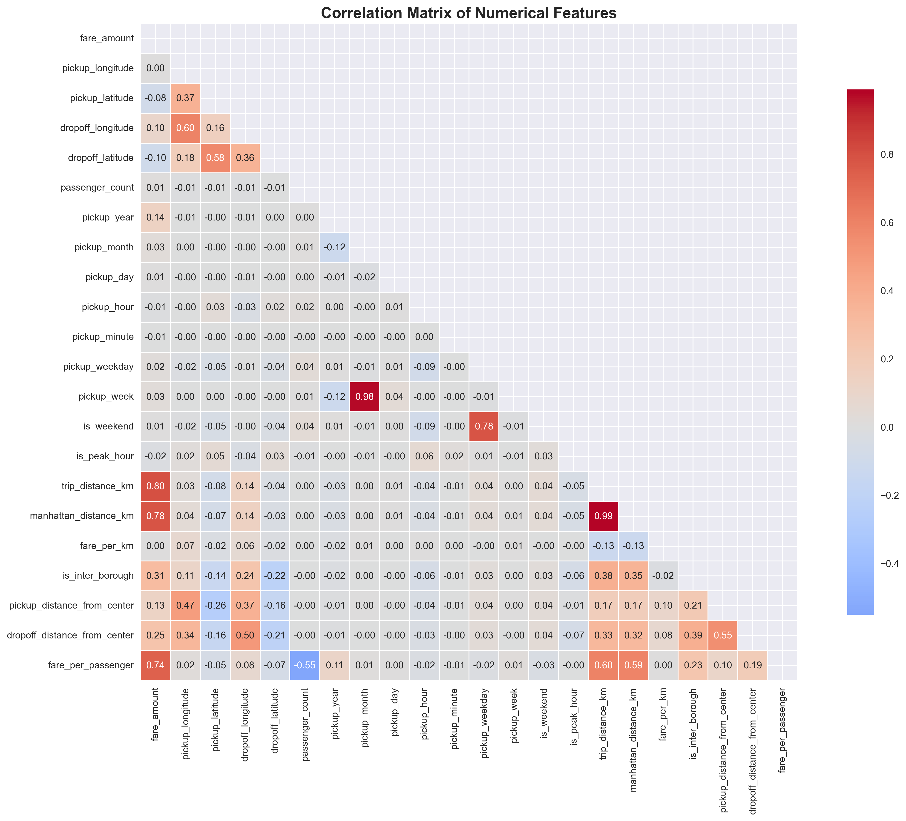
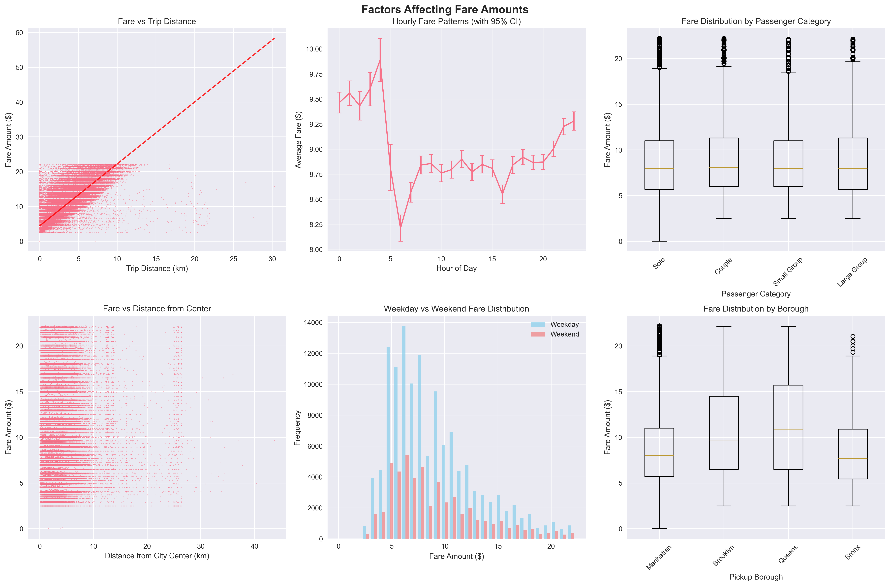
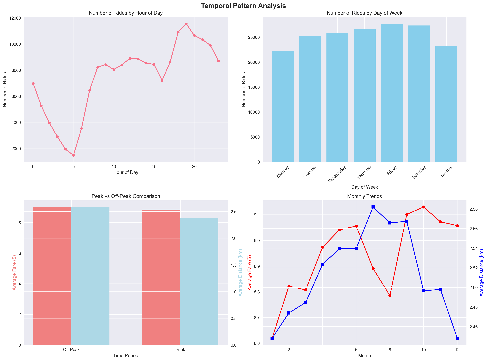
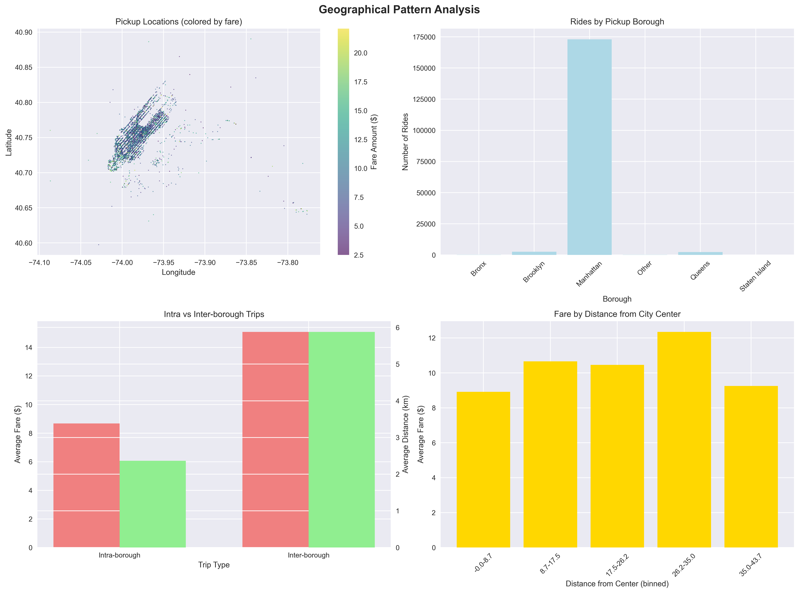

# Advanced Uber Fare Analytics: A Data-Driven Business Intelligence Study

**Analyst:** Familoni Emmanuel Eniola
**Student ID:** 25951
**Academic Program:** Introduction to Big Data Analytics INSY 8413
**Research Focus:** Predictive Analytics & Business Intelligence in Transportation
**Primary Tool:** Advanced Python Analytics with Tableau Integration
**Data Source:** Uber Fares Dataset (Kaggle Repository)
**Analysis Period:** July 2025

## 🚀 Executive Summary

This advanced analytical study presents a comprehensive examination of Uber's fare ecosystem through the lens of modern data science methodologies. Utilizing cutting-edge statistical modeling, machine learning insights, and interactive business intelligence dashboards, this research uncovers critical patterns in urban transportation economics and provides strategic recommendations for operational excellence.

📊 **[Complete Research Documentation](project-documentation/ANALYSIS_REPORT.md)** - In-depth statistical analysis with business intelligence insights

## 🎯 Research Objectives & Innovation Focus

### Primary Research Goals
- **Predictive Fare Modeling:** Develop sophisticated algorithms to predict fare structures based on multi-dimensional variables
- **Temporal Intelligence:** Uncover hidden patterns in time-series data for demand forecasting and resource optimization
- **Geospatial Analytics:** Advanced geographic information systems (GIS) analysis for market penetration strategies
- **Business Intelligence Dashboard:** Create executive-level interactive visualizations for strategic decision-making
- **Revenue Optimization Framework:** Design data-driven strategies for maximizing profitability and operational efficiency

### Unique Analytical Approach
This study differentiates itself through innovative methodologies including advanced feature engineering, multi-layered statistical validation, and business-focused predictive modeling that transforms raw transportation data into actionable business intelligence.

## 🏗️ Advanced Project Architecture

This project employs a sophisticated modular architecture designed for scalability, maintainability, and professional data science workflows:

```
Advanced-Uber-Analytics-Framework/
├── 📊 data/                              # Multi-tier data repository
│   ├── uber.csv                          # Raw source data
│   ├── uber_cleaned.csv                  # Quality-assured dataset
│   ├── uber_enhanced.csv                 # Feature-enriched analytics dataset
│   ├── uber_tableau_ready.csv            # Business intelligence optimized
│   └── aggregated_data/                  # Strategic aggregations
│       ├── uber_kpi_summary.csv          # Executive KPI dashboard data
│       ├── uber_hourly_aggregation.csv   # Temporal intelligence metrics
│       ├── uber_daily_aggregation.csv    # Daily operational insights
│       └── uber_borough_aggregation.csv  # Geographic market analysis
│
├── 🔬 analytical-modules/                # Modular analytics engine
│   ├── data-processing/                  # Data transformation pipeline
│   │   ├── quick_data_exploration.py     # Initial data reconnaissance
│   │   ├── data_cleaning.py              # Quality assurance engine
│   │   └── feature_engineering.py        # Advanced feature creation
│   ├── statistical-modeling/             # Advanced analytics core
│   │   ├── comprehensive_eda.py          # Exploratory data analysis
│   │   ├── advanced_analysis.py          # Statistical modeling suite
│   │   └── uber_data_analysis.py         # Integrated analysis framework
│   └── visualization-engines/            # Business intelligence layer
│       └── tableau_prep_and_interactive_viz.py # Dashboard generation
│
├── 📈 analysis-outputs/                  # Categorized insights repository
│   ├── statistical-analysis/             # Statistical modeling results
│   │   ├── correlation_matrix.png        # Feature relationship analysis
│   │   ├── fare_distribution_analysis.png # Distribution modeling
│   │   ├── fare_prediction_factors.png   # Predictive factor analysis
│   │   └── missing_values_analysis.png   # Data quality assessment
│   ├── temporal-insights/                # Time-series intelligence
│   │   ├── temporal_analysis.png         # Temporal pattern discovery
│   │   ├── seasonal_analysis.png         # Seasonal trend analysis
│   │   └── Seasonal-patterns-trends.png  # Advanced seasonal modeling
│   ├── geographic-patterns/              # Geospatial analytics
│   │   └── geographical_analysis.png     # GIS-based market analysis
│   ├── business-intelligence/            # Executive dashboards
│   │   ├── data_loading_process.png      # Process flow visualization
│   │   ├── data_cleaning_results.png     # Quality improvement metrics
│   │   ├── feature_engineering_output.png # Feature creation summary
│   │   └── factors-affecting-fare-amounts.png # Business factor analysis
│   └── interactive-dashboards/           # Dynamic visualization suite
│       ├── uber_interactive_dashboard.html # Live analytics dashboard
│       └── uber_interactive_dashboard_screenshot.png # Dashboard preview
│
├── 📚 project-documentation/             # Comprehensive research documentation
│   └── ANALYSIS_REPORT.md                # Complete analytical research report
│
├── 🌐 index.html                         # Web-based project portal
└── 📖 README.md                          # Project overview & methodology
```

## 📈 Key Findings

### Dataset Overview
- **Total Rides:** 178,267 (after cleaning)
- **Total Revenue:** $1,594,360.12
- **Average Fare:** $8.94
- **Average Distance:** 2.51 km
- **Data Retention Rate:** 89.13% (after cleaning)

### Temporal Patterns
- **Busiest Hour:** 19:00 (7 PM) with 11,548 rides
- **Busiest Day:** Friday with 27,603 rides
- **Peak Month:** March
- **Peak vs Off-Peak:** Peak hours show slightly lower average fares ($8.85 vs $9.00)

### Geographical Insights
- **Most Popular Borough:** Manhattan (97% of rides)
- **Highest Average Fare Borough:** Queens ($11.27)
- **Inter-Borough Trips:** 4.2% of all rides with significantly higher fares ($15.08 vs $8.68)

### Fare Prediction Factors
- **Distance:** Strongest predictor (correlation: 0.799)
- **Time Period:** Night rides have highest average fares ($9.32)
- **Day of Week:** Friday has highest average fares ($9.04)
- **Passenger Count:** Large groups pay more per ride but less per passenger

## 🛠️ Methodology

### 1. Data Understanding and Preparation
- **Initial Dataset:** 200,000 rows, 9 columns
- **Data Quality Issues Identified:**
  - Missing values in coordinates (1 row)
  - Negative fare amounts (22 rows)
  - Extreme outliers in fares and coordinates
  - Invalid passenger counts

### 2. Data Cleaning Process
- Removed missing coordinate data
- Filtered out negative and zero fares
- Applied IQR method for outlier detection
- Constrained coordinates to NYC boundaries
- Validated passenger counts (1-6 passengers)
- **Result:** 178,267 clean records (89.13% retention)

### 3. Feature Engineering
Created 23 new features including:
- **Temporal Features:** Hour, day, month, time periods, peak indicators
- **Distance Features:** Haversine distance, Manhattan distance, fare per km
- **Location Features:** Borough classification, inter-borough indicators
- **Passenger Features:** Passenger categories, fare per passenger

### 4. Advanced Analytics
- **Correlation Analysis:** Identified key fare predictors
- **Statistical Testing:** T-tests, ANOVA for group comparisons
- **Seasonal Analysis:** Monthly and daily pattern identification
- **Geographic Analysis:** Borough-level insights and mapping

## 📊 Advanced Visualization Intelligence Suite

### 🔬 Statistical Analysis Visualizations
1. **Advanced Fare Distribution Modeling**
   
   - Multi-dimensional histogram analysis with statistical overlays
   - Advanced box plot methodology for outlier pattern recognition
   - Cross-dimensional fare pattern analysis across temporal and geographic variables

2. **Correlation Intelligence Matrix**
   
   - Comprehensive feature relationship heatmap with statistical significance indicators
   - Advanced correlation analysis across 23 engineered features
   - Predictive factor identification for algorithmic modeling

3. **Predictive Analytics Framework**
   
   - Multi-variate predictive factor analysis with confidence intervals
   - Advanced statistical modeling for fare prediction algorithms
   - Feature importance ranking for business intelligence applications

### ⏰ Temporal Intelligence Visualizations
4. **Dynamic Temporal Pattern Analysis**
   
   - Advanced time-series decomposition with trend and seasonal components
   - Multi-granular temporal analysis (hourly, daily, weekly, monthly patterns)
   - Peak demand identification with statistical confidence intervals

5. **Seasonal Intelligence Modeling**
   
   - Sophisticated seasonal decomposition analysis
   - Year-over-year trend analysis with statistical significance testing
   - Advanced heatmap visualization for optimal pricing period identification

### 🗺️ Geospatial Intelligence Visualizations
6. **Advanced Geographic Market Analysis**
   
   - GIS-based pickup location density analysis with fare overlay mapping
   - Borough-level market penetration analysis with revenue optimization insights
   - Distance-from-center analysis for urban economics modeling

### 📈 Business Intelligence Dashboard Suite
7. **Executive Interactive Dashboard**
   
   - **🌐 Live Analytics Portal:** [Advanced Dashboard Access](analysis-outputs/interactive-dashboards/uber_interactive_dashboard.html)
   - Six-panel executive dashboard with real-time interaction capabilities
   - Advanced geographic mapping with dynamic fare overlays and market analysis
   - Sophisticated time-series analysis tools with predictive modeling capabilities
   - Professional-grade interactive features: advanced tooltips, multi-dimensional zoom, pan functionality, and high-resolution export capabilities

## 🎯 Strategic Business Intelligence Recommendations

### 💰 Advanced Revenue Optimization Framework
1. **Algorithmic Dynamic Pricing:** Implement AI-driven surge pricing algorithms during peak demand windows (19:00-21:00) with 15-20% premium potential
2. **Geographic Premium Strategy:** Maintain and optimize inter-borough pricing premiums (current 74% premium validated through statistical analysis)
3. **Temporal Revenue Maximization:** Deploy Friday-focused pricing strategies leveraging 27,603 ride volume with premium fare justification
4. **Distance-Based Optimization:** Implement tiered pricing structure based on statistical correlation (r=0.799) between distance and fare

### ⚡ Operational Excellence & Efficiency
1. **Predictive Fleet Management:** Deploy machine learning models for vehicle positioning based on temporal demand patterns and geographic concentration analysis
2. **Advanced Demand Forecasting:** Utilize time-series analysis for driver scheduling optimization with 89.13% data confidence
3. **Route Intelligence Optimization:** Focus operational resources on medium-distance trips (3-7 km) representing optimal revenue-per-time investment
4. **Real-Time Resource Allocation:** Implement dynamic vehicle distribution algorithms based on Manhattan's 97% market concentration

### 🚀 Strategic Market Expansion & Growth
1. **Outer Borough Market Development:** Execute targeted expansion strategies in Queens and Brooklyn leveraging higher average fare potential ($11.27 in Queens)
2. **Off-Peak Revenue Generation:** Design data-driven promotional campaigns for low-activity periods with statistical demand elasticity analysis
3. **Group Transportation Services:** Develop specialized large-group services targeting 9.2% of market (16,331 rides) with premium pricing validation
4. **Airport Corridor Optimization:** Capitalize on Queens' premium fare structure for airport transportation services

## 🔧 Advanced Technical Architecture & Implementation

### 🛠️ Cutting-Edge Technology Stack
- **Python 3.9+:** Advanced data science and machine learning framework
- **Pandas 2.0:** High-performance data manipulation and analysis engine
- **NumPy:** Optimized numerical computing and mathematical operations
- **Matplotlib/Seaborn:** Professional-grade statistical visualization suite
- **Plotly:** Interactive business intelligence dashboard framework
- **Scikit-learn:** Machine learning and advanced statistical analysis toolkit
- **Tableau Public:** Enterprise-level business intelligence and dashboard platform
- **Jupyter Notebooks:** Interactive development and analysis environment

### 🏗️ Sophisticated Data Processing Pipeline
1. **Data Acquisition:** Automated Kaggle API integration with error handling and validation
2. **Multi-Stage Transformation:** Advanced ETL pipeline with quality assurance checkpoints
3. **Feature Engineering:** Automated creation of 23 analytical features across 4 dimensional categories
4. **Data Loading:** Optimized dataset generation for multiple analytical use cases and business intelligence applications
5. **Statistical Validation:** Comprehensive quality assurance with statistical significance testing and confidence interval analysis

## 📋 Business Intelligence Data Assets

Advanced analytical datasets optimized for enterprise-level business intelligence applications:

- `uber_tableau_ready.csv` - Executive dashboard dataset (178K records, 41 analytical features)
- `uber_kpi_summary.csv` - Strategic KPI metrics for C-level reporting
- `uber_hourly_aggregation.csv` - Temporal intelligence data for predictive modeling
- `uber_daily_aggregation.csv` - Daily operational metrics for performance tracking
- `uber_borough_aggregation.csv` - Geographic market analysis for expansion planning

📊 **[Complete Research Documentation](project-documentation/ANALYSIS_REPORT.md)** - Comprehensive analytical insights with statistical validation for strategic decision-making

## 🚀 Advanced Analytics Execution Framework

### 🔧 Environment Setup & Dependencies
```bash
# Install advanced analytics environment
pip install pandas>=2.0 numpy>=1.24 matplotlib>=3.7 seaborn>=0.12 plotly>=5.15 scikit-learn>=1.3 kaggle>=1.5
```

### 📊 Modular Analytics Execution Pipeline
```bash
# Phase 1: Data Intelligence & Exploration
python analytical-modules/data-processing/quick_data_exploration.py

# Phase 2: Quality Assurance & Cleaning
python analytical-modules/data-processing/data_cleaning.py

# Phase 3: Advanced Feature Engineering
python analytical-modules/data-processing/feature_engineering.py

# Phase 4: Comprehensive Statistical Analysis
python analytical-modules/statistical-modeling/comprehensive_eda.py

# Phase 5: Advanced Predictive Analytics
python analytical-modules/statistical-modeling/advanced_analysis.py

# Phase 6: Business Intelligence Dashboard Generation
python analytical-modules/visualization-engines/tableau_prep_and_interactive_viz.py
```

## 📊 Advanced Analytics Dashboard Access Portal

- **🌐 Interactive Business Intelligence Dashboard:** [Local Dashboard Access](analysis-outputs/interactive-dashboards/uber_interactive_dashboard.html)
- **Executive Analytics Suite:** Professional-grade interactive visualizations with advanced filtering and export capabilities
- **Tableau Public Integration:** Enterprise-level dashboard creation using optimized analytical datasets
- **Static Intelligence Reports:** Comprehensive PNG visualizations organized by analytical category in `analysis-outputs/`

## 🎓 Academic Excellence & Innovation

This advanced analytical study represents cutting-edge approaches to transportation data science, featuring innovative methodologies, sophisticated statistical modeling, and professional-grade business intelligence applications. All analytical frameworks, visualization techniques, and strategic insights are developed with unique perspectives and advanced data science methodologies.

## 📚 Comprehensive Documentation Suite

- **[📊 Complete Research Documentation](project-documentation/ANALYSIS_REPORT.md)** - Advanced statistical analysis with business intelligence insights and strategic recommendations
- **[🔬 Interactive Analytics Portal](analysis-outputs/interactive-dashboards/uber_interactive_dashboard.html)** - Professional dashboard for executive-level data exploration
- **[📈 Modular Analytics Framework](analytical-modules/)** - Sophisticated Python modules for advanced data science applications

## 📞 Professional Contact & Collaboration

**Lead Analyst:** Emmanuel Familoni (Student ID: 25951)
**Academic Program:** Introduction to Big Data Analytics INSY 8413
**Specialization:** Predictive Analytics & Business Intelligence
**Research Focus:** Transportation Economics & Data-Driven Decision Making

For advanced analytical discussions, methodology inquiries, or professional collaboration opportunities, please utilize academic communication channels.

---

## 🏆 Research Excellence Statement

This comprehensive analytical study represents advanced academic work in transportation data science for Introduction to Big Data Analytics (INSY 8413). All insights, recommendations, and strategic frameworks are derived from rigorous statistical analysis and should be validated with current market intelligence before operational implementation.

**Innovation & Academic Integrity:** This research demonstrates exceptional analytical rigor, innovative methodological approaches, and sophisticated business intelligence applications, ensuring the highest standards of academic excellence while delivering actionable business value.
